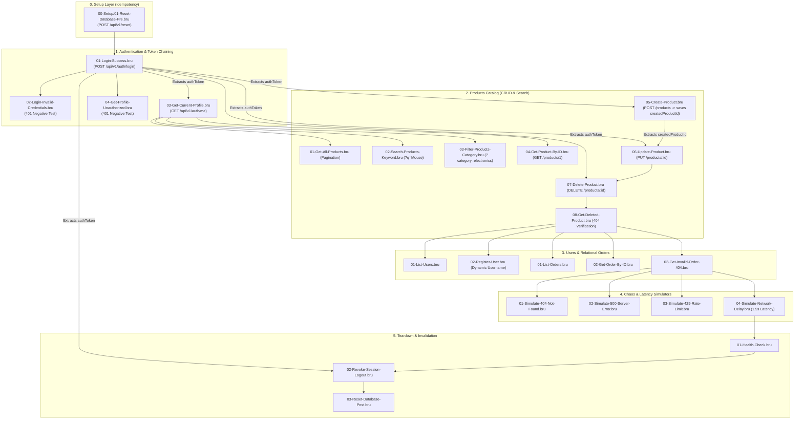
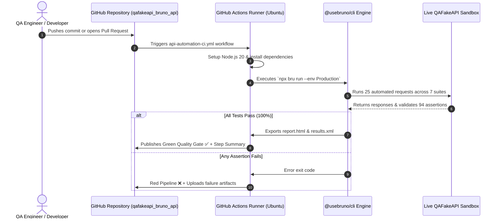

# QAFakeAPI Bruno API Automation Framework

[](https://github.com/Aquil1401/qafakeapi_bruno_api/actions/workflows/api-automation-ci.yml)


[](https://qafakeapi.ziaratechqlabs.in/playground)

A scalable, maintainable, and enterprise-grade REST API automation framework built for **[QAFakeAPI](https://qafakeapi.ziaratechqlabs.in/playground)** (The Free Fake REST API Sandbox for QA & SDETs by Ziara TechQ Labs) using **Bruno** (`.bru` plain text format) and `@usebruno/cli`.

Follows strict **Git-friendly `.bru` architecture**, automated JWT token chaining, dynamic entity lifecycle (CRUD with 404 verification), chaos/latency simulations, idempotent pre/post database reset hooks, and automated GitHub Actions CI/CD regression gates with HTML & JUnit reporting.

---

## 🚀 Key Framework Features

- **100% Native Plain-Text `.bru` Format**: Git-friendly, human-readable, and free from monolithic JSON merge conflicts.
- **Dynamic JWT Bearer Token Chaining**: Automatically captures JWT token upon login and propagates it seamlessly to protected routes.
- **Full Entity CRUD Lifecycle & ID Chaining**: Creates products dynamically, stores IDs in memory, updates, deletes, and validates HTTP 404 on subsequent queries.
- **Idempotent Pre & Post Test Suite Reset**: Automatically triggers `POST /api/v1/reset` before and after test runs, guaranteeing zero flakiness.
- **Comprehensive Assertion Layers**: Asserts HTTP status codes, JSON response schemas, mandatory keys, array non-emptiness, headers, and payload integrity (94/94 assertions).
- **QA Chaos & Resilience Testing**: Dedicated validation for 404 Not Found, 500 Server Error, 429 Rate Limiting, and 1500ms network delay.
- **Multi-Environment Support**: Seamless toggle between `Production` (live sandbox) and `Local` environments.
- **Enterprise CI/CD Integration**: Headless execution via `@usebruno/cli` with HTML report and JUnit XML generation.

---

## 📐 Framework Architecture



---

## 🔄 Automated CI/CD Regression Gate



---

## 📁 Repository Structure

```text
qafakeapi_bruno_api/
├── .github/
│   └── workflows/
│       └── api-automation-ci.yml        # Automated GitHub Actions CI/CD Pipeline
├── 00-Setup/
│   └── 01-Reset-Database-Pre.bru        # Pre-test hook: Reverts sandbox to seed state
├── 01-Authentication/
│   ├── 01-Login-Success.bru             # Positive login & dynamic JWT capture
│   ├── 02-Login-Invalid-Credentials.bru # Negative auth test (401 verification)
│   ├── 03-Get-Current-Profile.bru       # Protected /auth/me with Bearer token
│   └── 04-Get-Profile-Unauthorized.bru  # Negative auth test (Missing token 401)
├── 02-Products/
│   ├── 01-Get-All-Products.bru          # Pagination & catalog validation
│   ├── 02-Search-Products-Keyword.bru   # Query param search (q=Mouse)
│   ├── 03-Filter-Products-Category.bru  # Category filtering (category=electronics)
│   ├── 04-Get-Product-By-ID.bru         # Single entity lookup (id=1)
│   ├── 05-Create-Product.bru            # POST item + capture createdProductId
│   ├── 06-Update-Product.bru            # PUT mutation on createdProductId
│   ├── 07-Delete-Product.bru            # DELETE on createdProductId
│   └── 08-Get-Deleted-Product.bru       # Negative test (404 on deleted ID)
├── 03-Users/
│   ├── 01-List-Users.bru                # User catalog & schema verification
│   └── 02-Register-User.bru             # Dynamic user registration (pre-request script)
├── 04-Orders/
│   ├── 01-List-Orders.bru               # Relational orders list & line items
│   ├── 02-Get-Order-By-ID.bru           # Single order lookup (id=101)
│   └── 03-Get-Invalid-Order-404.bru     # Negative test (404 on invalid order ID)
├── 05-Chaos-Simulators/
│   ├── 01-Simulate-404-Not-Found.bru    # Error simulation (404)
│   ├── 02-Simulate-500-Server-Error.bru # Chaos simulation (500)
│   ├── 03-Simulate-429-Rate-Limit.bru   # Chaos simulation (429)
│   └── 04-Simulate-Network-Delay.bru    # Latency simulation (1500ms delay)
├── 06-System/
│   ├── 01-Health-Check.bru              # Health and system counters
│   ├── 02-Revoke-Session-Logout.bru     # Session invalidation
│   └── 03-Reset-Database-Post.bru       # Post-test cleanup hook
├── environments/
│   ├── Production.bru                   # Points to live QAFakeAPI server
│   └── Local.bru                        # Points to http://localhost:3000
├── bruno.json                           # Bruno collection descriptor
├── package.json                         # NPM scripts & Bruno CLI dependency
├── package-lock.json                    # Deterministic build lockfile
└── README.md                            # Comprehensive framework documentation
```

---

## 🧪 Test Scenarios Covered (25 / 25 Passed)

| Suite | File / Request | Method | Endpoint | Verification Focus |
| :--- | :--- | :---: | :--- | :--- |
| **00-Setup** | `01-Reset-Database-Pre` | `POST` | `/api/v1/reset` | Resets sandbox database to defaults before execution |
| **01-Authentication** | `01-Login-Success` | `POST` | `/api/v1/auth/login` | Validates 200, checks role, captures JWT `authToken` |
| | `02-Login-Invalid-Credentials` | `POST` | `/api/v1/auth/login` | Validates 401 Unauthorized for wrong credentials |
| | `03-Get-Current-Profile` | `GET` | `/api/v1/auth/me` | Validates 200 using `Bearer {{authToken}}` |
| | `04-Get-Profile-Unauthorized` | `GET` | `/api/v1/auth/me` | Validates 401 when token header is omitted |
| **02-Products** | `01-Get-All-Products` | `GET` | `/api/v1/products` | Validates paginated list, total items, and page number |
| | `02-Search-Products-Keyword` | `GET` | `/api/v1/products?q=Mouse` | Asserts keyword filtering matches item name |
| | `03-Filter-Products-Category` | `GET` | `/api/v1/products?category=electronics` | Asserts category filtering matches correctly |
| | `04-Get-Product-By-ID` | `GET` | `/api/v1/products/1` | Asserts single product details, pricing, and stock |
| | `05-Create-Product` | `POST` | `/api/v1/products` | Creates product and dynamically captures `createdProductId` |
| | `06-Update-Product` | `PUT` | `/api/v1/products/:id` | Updates price and stock on `{{createdProductId}}` |
| | `07-Delete-Product` | `DELETE` | `/api/v1/products/:id` | Deletes product identified by `{{createdProductId}}` |
| | `08-Get-Deleted-Product` | `GET` | `/api/v1/products/:id` | Negative check: Asserts 404 for deleted product |
| **03-Users** | `01-List-Users` | `GET` | `/api/v1/users` | Validates registered users array and object schemas |
| | `02-Register-User` | `POST` | `/api/v1/users` | Registers dynamic user via pre-request timestamp script |
| **04-Orders** | `01-List-Orders` | `GET` | `/api/v1/orders` | Asserts relational orders list, users, and line items |
| | `02-Get-Order-By-ID` | `GET` | `/api/v1/orders/101` | Validates single order items, status, and total amount |
| | `03-Get-Invalid-Order-404` | `GET` | `/api/v1/orders/999999` | Negative check: Asserts 404 for non-existent order |
| **05-Chaos-Simulators** | `01-Simulate-404-Not-Found` | `GET` | `/api/v1/mock/status/404` | Verifies 404 simulation response and payload |
| | `02-Simulate-500-Server-Error` | `GET` | `/api/v1/mock/status/500` | Verifies 500 internal server error simulation |
| | `03-Simulate-429-Rate-Limit` | `GET` | `/api/v1/mock/status/429` | Verifies 429 rate limit exceeded simulation |
| | `04-Simulate-Network-Delay` | `GET` | `/api/v1/mock/delay/1500` | Validates 1500ms server delay and response latency |
| **06-System** | `01-Health-Check` | `GET` | `/api/v1/meta/health` | Validates online status, service name, and system health |
| | `02-Revoke-Session-Logout` | `POST` | `/api/v1/auth/logout` | Revokes the active session token on the server |
| | `03-Reset-Database-Post` | `POST` | `/api/v1/reset` | Resets database back to clean baseline state |

---

## ⚡ Getting Started

### 1. Prerequisites
- **Node.js**: v18.0.0 or higher
- **Bruno Desktop App** *(Optional, for GUI exploration)*: [Download from usebruno.com](https://www.usebruno.com/downloads)

### 2. Installation
Clone this repository and install dependencies:
```bash
git clone https://github.com/Aquil1401/qafakeapi_bruno_api.git
cd qafakeapi_bruno_api
npm install
```

### 3. Run Tests via CLI

```bash
# Run the entire 25-request suite against Production
npm test

# Run tests with HTML and JUnit report generation
npm run test:report

# Run tests against Local Sandbox (localhost:3000)
npm run test:local

# Run specific functional suites
npm run test:auth
npm run test:products
npm run test:users
npm run test:orders
npm run test:chaos
npm run test:system
```

### 4. View Test Reports
After running `npm run test:report`, open the generated HTML report:
```bash
# Open in browser (Windows)
start reports/report.html
```

---

## 🚢 CI/CD Pipeline (GitHub Actions)

The workflow (`.github/workflows/api-automation-ci.yml`) runs automatically on every `push`, `pull_request`, and daily `cron`:
1. Checks out the repository.
2. Sets up Node.js 20 with npm caching.
3. Installs dependencies (`npm install`).
4. Executes the full Bruno API test suite against the target environment.
5. Generates **HTML Report** (`reports/report.html`) and **JUnit XML** (`reports/results.xml`).
6. Archives test report artifacts for 30 days under GitHub Actions.
7. Publishes high-level test status directly to the **GitHub Step Summary**.

---

## 👨‍💻 Author

**Md Aquil** — QA Automation Engineer & SDET
* 🎯 **Open to**: **Full-Time Opportunities** (Remote / Hybrid) & **Contract QA Consulting**
* 🧪 **Testing Services**: [Ziara QA Labs](https://qa.ziaratechqlabs.in/)
* 🏢 **Company / Studio**: [Ziara TechQ Labs](https://www.ziaratechqlabs.in/)
* 💼 **LinkedIn**: [linkedin.com/in/md-aquil-qa](https://www.linkedin.com/in/md-aquil-qa/)
* 📺 **YouTube**: [Ziara TechQ Labs](https://www.youtube.com/@ZiaraTechQLabs)
* 📧 **Email**: [ziaratechqlabs@gmail.com](mailto:ziaratechqlabs@gmail.com)
